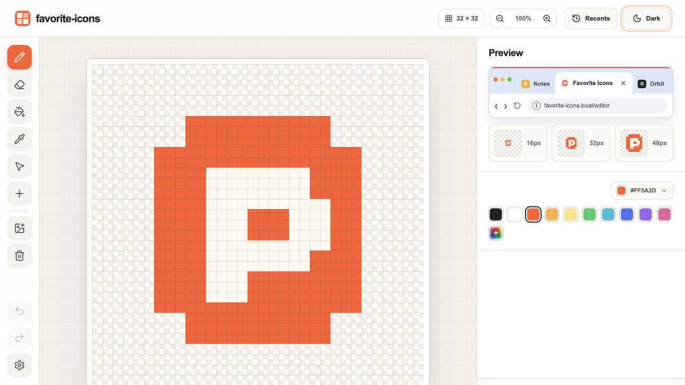

# favorite-icons

A browser-based pixel editor for creating and exporting favicons. Everything
runs locally in the browser and no data leaves tot outside sources.

[Open the live page](https://jussikauhanen.github.io/favorite-icons/)

## Features

- 32 × 32 pixel editor with drawing, fill, shape, and color tools
- Live favicon previews in multiple sizes
- Image import, light and dark themes, and local draft saving
- PNG, ICO, and complete website favicon exports

## Run locally

Clone the repository and open `index.html` in a browser. No installation or
build step is required.
